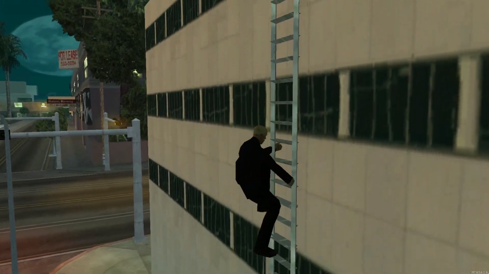

# 🚩 Sistema de escada.



> Sistema de escadas com criação automática de objetos, totalmente sincronizado com o servidor e otimizado.

## Instalação

1. Faça o download do MTA:SA em sua maquina: https://multitheftauto.com/
2. Faça o clone ou download do repositório.
3. Coloque o projeto na pasta: "MTA San Andreas 1.6\server\mods\deathmatch\resources\mta-gps".

## Exports/triggers

#### Criar escada.

```lua
exports["mta-ladders"]:createLadder(x, y, z, r, dimension, height)
```

| Parâmetro   | Tipo    | Descrição           |
| :---------- | :------ | :------------------ |
| `x`         | `float` | Posição x do mapa   |
| `y`         | `float` | Posição y do mapa   |
| `z`         | `float` | Posição z do mapa   |
| `r`         | `float` | Rotação do objeto   |
| `dimension` | `int`   | Dimension do objeto |
| `height`    | `int`   | Altura do objeto    |

#### Destruir escada.

```lua
exports["mta-ladders"]:destroyLadder(object)
```

| Parâmetro | Tipo      | Descrição          |
| :-------- | :-------- | :----------------- |
| `object`  | `element` | Elemento da escada |

#### Verificar se um player esta usando a escada.

```lua
exports["mta-ladders"]:isPlayerUsingLadder(player)
```

| Parâmetro | Tipo      | Descrição          |
| :-------- | :-------- | :----------------- |
| `player`  | `element` | Elemento do player |

#### Remover o jogador da escada.

```lua
exports["mta-ladders"]:removePlayerLadder(player)
```

| Parâmetro | Tipo      | Descrição          |
| :-------- | :-------- | :----------------- |
| `player`  | `element` | Elemento do player |
